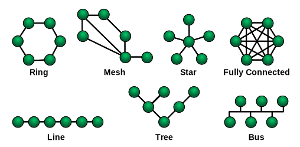
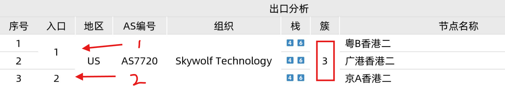

# 关于拓扑测试

概述

koipy的拓扑测试可以用来查看节点**入口** 与**出口** 之间的对应关系，可以用来大致估计数据的路由去向。

## 网络拓扑

关于网络拓扑(Network topology)的解释可以查看 [此地址](https://zh.wikipedia.org/wiki/%E7%BD%91%E7%BB%9C%E6%8B%93%E6%89%91)&#x20;

在了解拓扑测试之前，我们需要了解一下传统的典型网络拓扑图：

<figure><figcaption>
作者 NetworkTopologies.png: Maksim / 衍生作品: Malyszkz - 基于如下对象的个人作品： NetworkTopologies.png，公有领域，https://commons.wikimedia.org/w/index.php?curid=15006915
</figcaption></figure>

在这里，我们引出两个名词（入口和出口）

> 入口  —— 节点的配置文件中的地址
>
> 出口  —— 通过代理服务器后，网站获取的最终访问IP

相信各位已经发现问题：我们**无法控制经过入口后的流量，也就无法获得经过入口后的网络拓扑**

因此，需在这里事先说明，koipy的拓扑测试仅能获取入口/出口相关的IP/域名信息，暂时无法通过技术手段解决（如果你能，那在下顶礼膜拜）

## 入口拓扑

### 原理

获取节点配置文件上的地址，如果是IP地址，则直接通过geoip API获取IP地理位置等信息。

如果是域名，那么就稍微有点复杂了，它需要在后端那里使用DNS服务将域名解析为ip地址，然后同上IP处理方式。因为涉及到DNS解析，所以这里的门道会有一点多，这里会分情况讨论。

### 多IP解析

如果一个域名能够被DNS服务器解析出多个IP结果，那么会在拓扑结果图中显示的簇为 IP的数量

<figure><figcaption>
多IP结果解析示意图
</figcaption></figure>

### 双栈测试

如果一个域名能够被DNS服务器解析出IPV4和IPV6地址，那么会在拓扑结果图中栈显示为数字4和6

<figure><figcaption>
双栈结果解析示意图（红色框部分）
</figcaption></figure>

### 出口数量

一份配置文件中，往往有多个入口地址，koipy会将相同的入口地址的节点进行统计，统计得到的节点数量即为出口数量，入口会进行编号，每个编号的入口对应出口分析中的入口编号，下图展现的是，编号1的入口和其对应的出口节点

<figure><figcaption></figcaption></figure>

### 入口详细地区

对于地区编号为CN的入口，koipy会尝试通过GEOIP脚本获取更为精确的地区数据，但不保证每个入口IP都能查询到详细地区

### 后端结果差异性

有一些技术会导致后端解析的IP出现不一致，从而导致IP的地区信息不一致：

* DNS智能解析&#x20;

> 一些代理提供商针对不同地区有不同网络优化，DNS会根据地区的不同返回给后端不同的IP

## 出口拓扑

### 原理

通过代理环境经过HTTP协议请求一个网址，该网址记录访问者的IP，那么我们可以**近似认为**这是代理服务器的出口IP

比如你可以连接上代理，然后访问这个网址： [https://ip.sb/](https://ip.sb/)

就可以获取你当前的代理服务器IP，miaospeed后端也是同理，只不过多了批量获取出口IP的功能。

### 双栈测试

与入口测试不同，确定出口的IP的双栈测试是通过额外访问仅支持IPV6的网址而来的。通过访问一个仅有IPV6解析的地址，确定不出错地返回HTTP响应，那么我们就认为它是支持IPV6访问的。这可以给代理节点的使用者更好地体验。不会都2025年了，还有代理节点不支持IPV6网络吧😅

### 节点簇统计

koipy会对出口IP进行统计分析，对**相同的出口IP**进行累加，形成节点簇，在大部分情况下，如果这些节点簇大于1，那么我们可以近似认为（下面会讲到特殊情况）这些节点**是复用的**

<figure><figcaption>
节点复用示意图（三个节点出口IP均相同，来自两个入口）
</figcaption></figure>

复用原因：

* 多个不同入口对应同一个出口，涉及网络质量优化，比如电信用户用电信入口，移动用户用移动入口
* 同一个入口，同一个出口，但是分成多个节点，这种一般是为了省钱，营造运营噱头

特殊情况：

1. 多个节点不可用

坏掉了自然就无法获取到出口IP，这个时候koipy会把它们合并，簇会大于1，无法确定复用情况

<figure><figcaption>
编号27和28的节点不可用，被合并的示意图
</figcaption></figure>

2. 代理服务器的负载均衡

前面说过，我们无法获取中间的链路过程，所以存在一种可能，多个节点（往往是同个地区的）之间可能有负载均衡策略，这是受代理提供商调控的，它可能会自动把多个节点的流量都分配到同一台代理服务器上，这样表现出来的效果就是后端GEOIP脚本获取的出口IP均相同，出现这个情况建议咨询提供商进一步了解。

### 文本信息合并

为了保持美观，在拓扑图表格的同一列，koipy会对相邻行中的相同文本进行合并，仅显示一次，如下图所示：

蓝色方框表示1\~7号节点均为1号入口

红色方框表示1\~5号节点组织均相同

绿色方框表示8\~17号节点AS编号均相同

<figure><figcaption></figcaption></figure>

## IP信息查询

拿到入口以及出口所有IP后，后端就会通过GEOIP脚本，逐个查询IP的地理位置、所属ASN等信息，然后返回给主端（bot）

主端拿到测试结果，开始进行拓扑结果图片的绘制（简称拓扑图），最后发送到Telegram前端，整个拓扑测试结束

## GEOIP脚本

1. GeoIP（Geolocation IP）是一种通过IP地址确定设备地理位置的技术，其核心是基于IP地址与地理信息的映射数据库。
2. GeoIP数据库将IP地址映射到地理位置信息，包括国家、省/州、城市、经纬度等，这种映射可精确到不同层级，取决于提供这项服务的提供商
3. 有一些网络公开的服务商提供免费的基于HTTP API的查询服务，通过编写miaospeed的测试脚本，就可以方便地从互联网查询IP信息了，在此过程中，koipy将其命名为GEOIP脚本
4. GEOIP脚本内置在koipy主端中，每次测试都会发送给后端使用
5. IP信息在一天内不会变动得很频繁，出于资源的可利用性考虑，后端会缓存之前的查询结果，不会每次都会运行GEOIP脚本。IP查询结果的缓存时间为6小时，无法主动刷新缓存，可以重新启动后端清空缓存。

## 内置GEOIP脚本

koipy自带一个GEOIP脚本，此脚本路径为: ./resources/scripts/geo/geoip.js&#x20;

因为默认的脚本内有一些私有API（用来提供中国大陆详细地区查询）不方便公开，所以它是加密的。

如果你不想用默认的GEOIP脚本，可以在配置文件里覆写脚本路径，具体操作参见文档：


[scriptconfig.md](../pei-zhi-xiang-jie/scriptconfig.md)


值得注意的是，如果指定的自定义脚本路径不合法或者为文件内容为空，那么后端将使用自身的GEOIP脚本，也就是说后端和主端各有一套GEOIP脚本，后端的自带脚本是编译到二进制中，无法修改。正常情况下，后端不会使用自身的脚本，因为主端每次拓扑测试时都会发送自带的脚本给后端。

### MMDB本地数据库

还有一种情况就是，后端手动指定了mmdb本地数据库，这样所有的geoip查询将**优先**使用mmdb本地数据库，查询不到才执行脚本。如果你想启用mmdb本地数据库，请查看文档后端搭建指南部分：


[da-jian-zhi-nan](../miaospeed-hou-duan/da-jian-zhi-nan/)


### 使用自带命令行工具更新数据库：


[mmdb-shu-ju-ku.md](../miaospeed-hou-duan/mmdb-shu-ju-ku.md)


### 后端结果缓存

后端对于拓扑的地址位置等结果有一个内置缓存表，同一个IP的查询结果会**缓存6个小时**，这就意味着就算实时更改了脚本，后端也不会即时更新结果。这种特性是为了节省API资源，毕竟脚本里大部分是公开免费的API，需要取之有道。

如果你想立马刷新后端缓存，重启后端即可

## 杂谈

关于拓扑测试，目前来说局限性还是太大了。

1. 关于出口拓扑

出口拓扑实际上是可以作假的，这方面的操作性很高，所以**不要将测试结果奉为标准** ，仅供参考。

2. 遥想当年

早期代理界哪有什么拓扑测试，日益增长的需求，让大家对节点的要求也越来越高。出现拓扑的原因一方面是节点复用的兴起，另一方面是跨境电商、海外流媒体等增值服务对IP纯净度的要求日益增高。人们需要一个方便的工具来测试它们，koipy不是第一个先行者，是有需求而顺应天意出现，未来也会有更好的工具。

